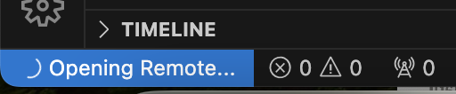
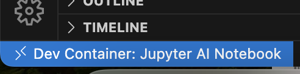

# 🛠 Tutorial: Setting up a Dev Container in VS Code

## 1. Install prerequisites
Make sure you have these installed on your system:
- **Docker Desktop** (Mac/Windows) or **Docker Engine** (Linux) → required to run containers.
- **Visual Studio Code**.
- VS Code extensions:
  - [**Dev Containers**](https://marketplace.visualstudio.com/items?itemName=ms-vscode-remote.remote-containers) (`ms-vscode-remote.remote-containers`).
  - (Optional) [Python](https://marketplace.visualstudio.com/items?itemName=ms-python.python) for Python development.

---

## 2. Set up project folder
1. Open your project folder in VS Code.
2. Create a `.devcontainer` directory at the root:
   ```bash
   mkdir .devcontainer
   ```
3. Inside `.devcontainer`, create a file named `devcontainer.json` and paste your config:

   ```jsonc
   {
     "name": "Jupyter AI Notebook",
     "image": "python:3.12-slim",
     "features": {},
     "forwardPorts": [8888, 11434],
     "mounts": [
       "source=${localWorkspaceFolder},target=/workspace,type=bind"
     ],
     "postCreateCommand": "apt-get update && apt-get install -y build-essential python3-dev && python3 -m venv /workspace/.venv && . /workspace/.venv/bin/activate && pip install --upgrade pip && pip install notebook jupyterlab langchain openai smolagents llama-index langgraph pandas matplotlib tiktoken python-dotenv litellm ddgs",
     "settings": {
       "python.defaultInterpreterPath": "/workspace/.venv/bin/python",
       "python.terminal.activateEnvironment": true
     },
     "remoteUser": "root",
     "runArgs": [
       "--cpus=4",
       "--memory=8g"
     ]
   }
   ```

---

## 3. Reopen folder in Dev Container
1. Press **F1** (or `Ctrl+Shift+P` / `Cmd+Shift+P`).
2. Search for → **Dev Containers: Reopen in Container**.
3. VS Code will:
   - Pull the base image (`python:3.12-slim`).
   - Run `postCreateCommand` to install dependencies.
   - Mount your workspace into `/workspace`.


---

## 4. Verify setup
Open a terminal inside VS Code (`Ctrl+``) and run:

```bash
python --version
pip list | grep jupyter
```

You should see **Python 3.12** and installed packages (`notebook`, `jupyterlab`, etc.).


✅ That’s it! Now you’re working inside a reproducible container environment with all your AI libraries preinstalled.
